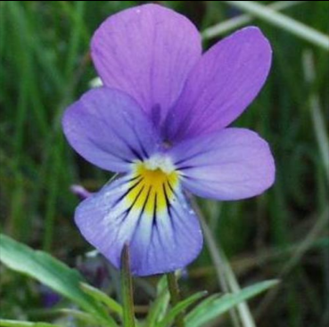
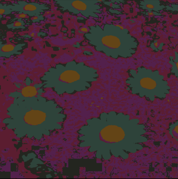
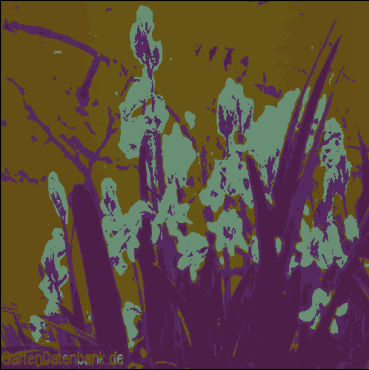
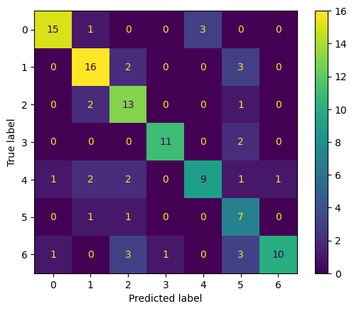
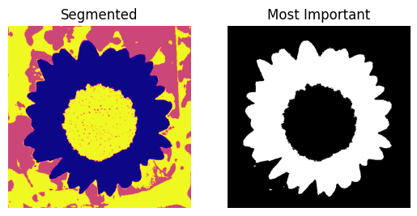
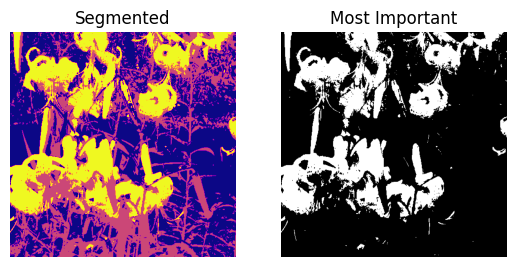

# Computational-Intelligence-Project

---

## Phase_1: Image Clustering and Classification

This phase focuses on clustering and classifying image data using advanced computational intelligence techniques. The workflow involves feature extraction, clustering, and classification, with thorough analysis and optimization for performance enhancement.

### Phase Objectives
- Perform feature extraction from images (color and spatial features).
- Cluster image pixels into meaningful regions using DBSCAN and K-Means algorithms.
- Extract statistical and spatial features for each region.
- Construct feature histograms to summarize image regions.
- Classify images using a Random Forest classifier based on the extracted histograms.
- Evaluate model performance with metrics such as Precision, Recall, F1-Score, and confusion matrices.
- Optimize clustering parameters to enhance classification accuracy.

### Key Steps
1. **Data Loading**: Load image data and labels from pickle files.

2. **Pixel-Level Feature Extraction**:
   - For each pixel in an image, extract a feature vector containing:
     - Color features: HSV (Hue, Saturation, Value) components.
     - Spatial features: X, Y coordinates (distance from the center).

3. **Pixel Clustering**:
   - Apply clustering algorithms (e.g., K-Means, DBSCAN) to group pixels into regions.
     - For K-Means, divide each image into 5 regions.
     - Evaluate clustering quality using metrics like Davies-Bouldin Index and Calinski-Harabasz Index.

  
  
  

Example of an input image before clustering.

 

  
  
  

Visual representation of regions clustered using K-Means (K=5).

4. **Region-Level Feature Extraction**:
   - For each region resulting from clustering, calculate:
     - **Color Statistics**: Mean, variance, skewness, and kurtosis for HSV channels.
     - **Spatial Features**: Total pixel count, region length and width, bounding box dimensions, and orientation angle relative to the horizontal axis.
   - Store all features in a single vector for each region.

5. **Region Clustering and Histogram Construction**:
   - Combine all region-level feature vectors across images.
   - Re-cluster these vectors using K-Means (e.g., into 70 clusters).
   - For each image, create a histogram representing the frequency of its regions in each cluster.

6. **Classification**:
   - Use the histograms as inputs to a Random Forest classifier.
   - Evaluate classification accuracy and analyze feature importance.

7. **Performance Evaluation**:
   - Compute metrics: Accuracy, Precision, Recall, F1-Score.
   - Analyze confusion matrices and identify misclassifications.

  

Confusion matrix showing the classification results for the best model.

### Results
- Best clustering results achieved using K-Means with \( K=5 \).
- Random Forest classification accuracy: **81.37%** based on histograms.
- Identified key factors affecting misclassification, including insufficient diversity in color features.
- Suggested improvements: Additional feature extraction (e.g., shape-based features) and optimized sampling.

---

## Phase_2: Image Region Optimization and Feature Selection

This phase focuses on optimizing the identified regions from the first phase and selecting the most impactful features for image classification. The workflow enhances the classification pipeline by refining regions and prioritizing features.

### Phase Objectives
- Refine the extracted regions by ranking and removing the least significant ones.
- Perform feature selection to identify the most impactful features for classification.
- Improve classification accuracy by reducing redundancy and emphasizing essential features.

### Key Steps
#### 1. **Region Ranking and Optimization**
- **Objective**: Identify and remove the least important regions to improve classification performance.
- **Process**:
  1. For each image, calculate the probability of predicting its class label using `predict_proba`.
  2. Rank regions based on their contribution to the class probability.
  3. Iteratively remove the least significant region and recalculate probabilities until only the most impactful regions remain.
- **Outcome**: A refined set of regions for each image.

  
  
  
   

Visual representation of regions clustered (segmented) images and their corresponding most important region.

 

#### 2. **Feature Selection**
- **Objective**: Select the most influential features from the refined regions for classification.
- **Process**:
  1. Use the refined region features as input to the classifier.
  2. Rank features by their impact on classification accuracy.
  3. Iteratively remove the least impactful features and evaluate performance.
  4. Stop the process when either:
     - The improvement in accuracy falls below a threshold (e.g., 0.02).
     - A maximum number of iterations is reached (e.g., 10).
- **Selected Features**:
  - Color statistics: Mean, variance, skewness, and kurtosis for HSV channels.
  - Spatial features: Total pixel count, bounding box dimensions, and orientation.

#### 3. **Performance Evaluation**
- Evaluate the optimized model using:
  - Accuracy.
  - Precision, Recall, and F1-Score.
  - Confusion matrix analysis.
- Compare results with the initial phase to demonstrate improvements.

### Results
- Optimized region selection improves classification performance.
- Feature selection identifies key contributors, reducing feature redundancy.
- Achieved higher classification accuracy compared to the initial phase.

## Future Improvements
- Extend the feature selection process to incorporate domain-specific knowledge.
- Explore alternative region-ranking methods for robustness.
- Test scalability on larger datasets with diverse image types.

---
This phase demonstrates significant enhancements to the classification pipeline by refining regions and selecting impactful features, setting the stage for further optimization and scalability.

---

### Requirements
- Python 3.8+
- Libraries: NumPy, OpenCV, Matplotlib, scikit-learn, pickle

